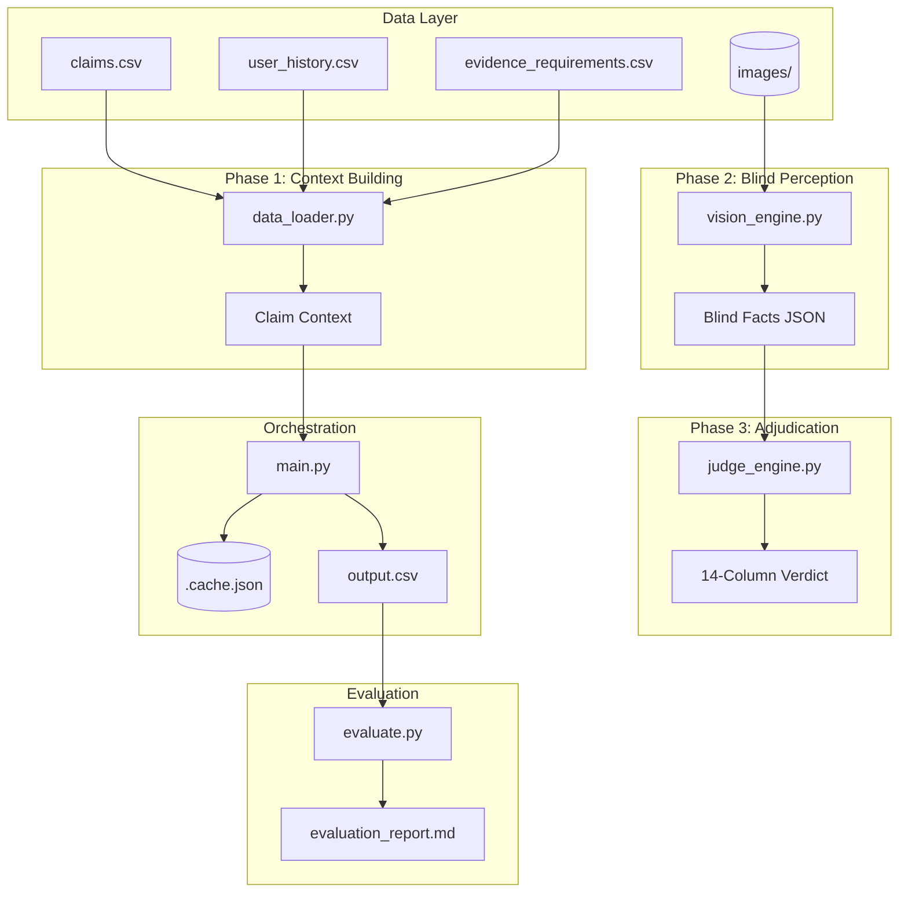
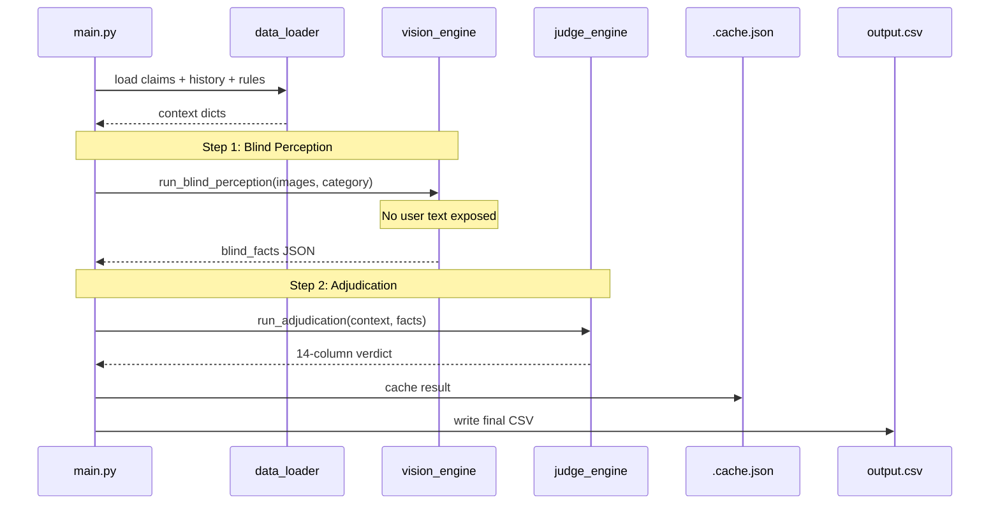
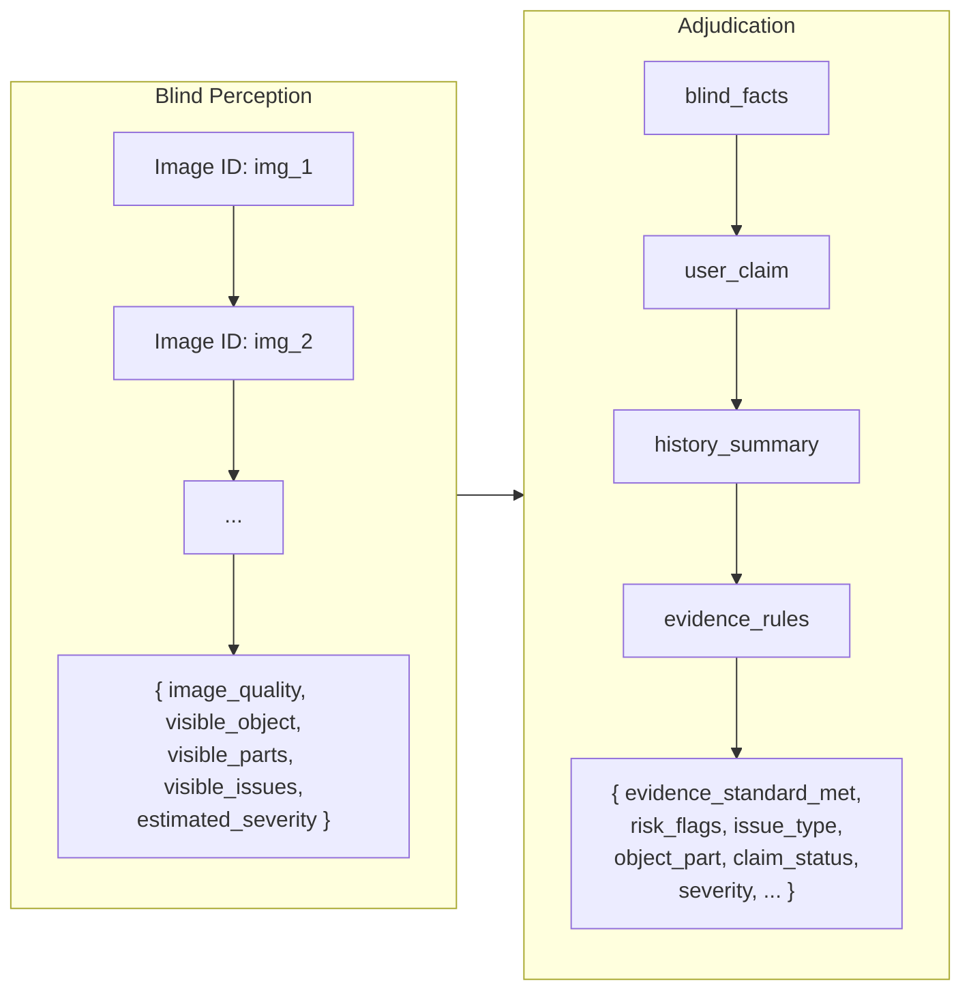

# Multimodel Damage Claims Orchestrator

> Two-step de-biased VLM pipeline for automated insurance claim adjudication.  
> Blind perception → evidence-based adjudication. No prompt injection. No anchoring bias.

---

## Architecture



## Two-Step Flow



## Pipeline Detail



---

## Tech Stack

| Component | Technology | Purpose |
|-----------|-----------|---------|
| Language | **Python 3.12+** | Type-safe, VLM SDK first-class support |
| CSV & Data | **pandas 2.x** | Tabular I/O, merging |
| VLM Client | **openai 1.x** | Universal OpenAI-compatible interface |
| Vision Model | **Gemini 1.5 Flash** | Free tier, multimodal, JSON mode |
| Accuracy | **scikit-learn 1.x** | Exact-match metrics |
| Threading | **concurrent.futures** | stdlib thread pool |
| Progress | **tqdm 4.x** | CLI progress bars |

**Why this stack?**  
The `openai` library works with any OpenAI-compatible endpoint (Gemini, Ollama, local proxies).  
No heavy frameworks — CSV over SQLite for 44 claims, ThreadPool over asyncio for simplicity.

---

## Project Structure

```
├── data_loader.py           Phase 1: CSV ingestion & context assembly
├── vision_engine.py         Phase 2: Blind VLM perception (no user text)
├── judge_engine.py          Phase 3: Facts vs claim adjudication
├── main.py                  Phase 4: Orchestration, cache, threading, retry
├── evaluation/
│   ├── evaluate.py          Phase 5: Accuracy metrics & report generation
│   └── evaluation_report.md
├── claims/
│   ├── claims.csv           44 claims (user_id, image_paths, user_claim, claim_object)
│   ├── user_history.csv     47 users (flags, summaries, stats)
│   ├── evidence_requirements.csv  11 evidence rules
│   ├── sample_claims.csv    20 ground-truth rows
│   └── output.csv           Header-only result template
└── .cache.json              Per-claim result cache (auto-generated)
```

---

## Threat Mitigation

| Threat | Mitigation |
|--------|-----------|
| Prompt injection | Vision step never sees user text |
| Anchoring bias | Blind perception before adjudication |
| Auto-approve instructions | Detected and flagged as `text_instruction_present` |
| Image quality issues | `image_quality` field in blind facts |
| History bias | History provided only to adjudicator, not vision |

---

## 14-Column Output

| Column | Allowed Values |
|--------|---------------|
| `evidence_standard_met` | `true`, `false` |
| `risk_flags` | `none`, `claim_mismatch`, `user_history_risk`, `text_instruction_present`, ... |
| `issue_type` | `dent`, `scratch`, `crack`, `broken_part`, `stain`, `crushed_packaging`, `torn_packaging`, `water_damage`, `none`, `unknown` |
| `object_part` | `rear_bumper`, `front_bumper`, `windshield`, `door`, `screen`, `hinge`, `keyboard`, `trackpad`, `package_corner`, `seal`, ... |
| `claim_status` | `supported`, `contradicted`, `not_enough_information` |
| `severity` | `none`, `low`, `medium`, `high`, `unknown` |

---

## Quick Start

```bash
# 1. Install
pip install pandas openai scikit-learn tqdm

# 2. Set environment
export OPENAI_API_KEY="your-gemini-api-key"
export OPENAI_BASE_URL="https://generativelanguage.googleapis.com/v1beta/openai/"
export MODEL_NAME="gemini-1.5-flash"

# 3. Run pipeline
python main.py

# 4. Evaluate
python evaluation/evaluate.py
```

**Cost:** $0.00 — Gemini 1.5 Flash free tier (1,500 req/day).

---

## Data Flow

```
claims.csv ──┐
user_history ─┤──▶ data_loader ──▶ context dict ──▶ main.py
evidence_reqs─┘                                       │
                                              ┌───────┴───────┐
                                              ▼               ▼
                                      vision_engine     judge_engine
                                      (blind facts)     (verdict)
                                              │               │
                                              └───────┬───────┘
                                                      ▼
                                              merge → output.csv
                                                      │
                                                      ▼
                                              evaluation/report.md
```

---

## Alternatives Considered

| Approach | Why Not Chosen |
|----------|---------------|
| Single VLM call (image + text) | Hallucinates damage matching text. No injection defense. |
| OpenCV rule-based | Can't generalize across car/laptop/package. No semantic understanding. |
| RAG pipeline | Adds complexity without solving anchoring bias. |
| PostgreSQL | 44 claims don't need a database. CSV is sufficient. |
| async/await | ThreadPool is simpler for IO-bound tasks. |

---

<p align="center">
  <sub>Built with OpenCode · DeepSeek V4 Flash Free</sub>
</p>
